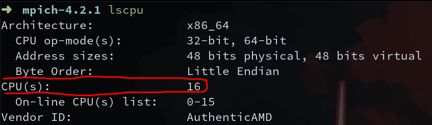
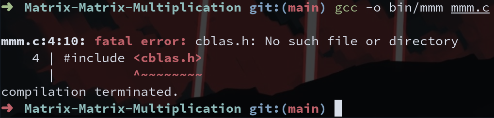

# BLAS Compilation

## Content
- [Introduction](#introduction)
- [What is BLAS?](#what-is-blas)
    - [What is OpenBLAS?](#what-is-openblas)
- [Compilation](#compilation)
- [How to Use OpenBLAS](#how-to-use-openblas)
- [References](#references)
- [Authors](#authors)

## Introduction
In this file, you will learn how to compile BLAS (specifically OpenBLAS) step by step. This is a good exercise for you because you will improve on topics we saw in the lectures (Environment Variables, and Compiling), and you will continue practicing the command line (and Linux), which is an essential tool in HPC.

We will start by explaining what BLAS is, then we will compile this OpenBLAS, and finally we will see how to use this library.

It is important to keep in mind that this is one of your first compilations, so there are some things you may not understand. However, feel free to ask questions. Also, there are some steps that are not entirely necessary, but you need practice to realize this.

With BLAS and MPICH, we are ready to start compiling HPL, but it will come later.

## What is BLAS?
The BLAS (Basic Linear Algebra Subprograms) are routines that provide standard building blocks for performing basic vector and matrix operations. The Level 1 BLAS perform scalar, vector and vector-vector operations, the Level 2 BLAS perform matrix-vector operations, and the Level 3 BLAS perform matrix-matrix operations. Because the BLAS are efficient, portable, and widely available, they are commonly used in the development of high quality linear algebra software, LAPACK for example.

### What is OpenBLAS?
OpenBLAS is an optimized Basic Linear Algebra Subprograms (BLAS) library based on GotoBLAS2 1.13 BSD version.

## Compilation
First, locate a directory to clone the GitHub repository. In my case, I'm going to be in the following directory:
```
/home/juan/University/SCAR/Apps/OpenBLAS
```
**NOTE:** This directory only exist on my compute; you will have a different directory, so ***be carefull***. 

Execute the following command to clone OpenBLAS repository from GitHub:
```
git clone https://github.com/OpenMathLib/OpenBLAS.git
```
This will create a new folder called `OpenBLAS`.

In the same directory that you are create a directory:
```
mkdir build_OpenBLAS
```

At this step, I recommend you enter the *build_OpenBLAS* directory and execute *pwd*. This will show you the path where you are. In my case:
```
/home/juan/University/SCAR/Apps/OpenBLAS/build_OpenBLAS
```
Save this path for later.


Go to the `OpenBLAS` directory (this directory was created by the `git clone` we did at the beggining) using:
```
cd OpenBLAS
```

Run the following command (this procces can take a while, so be patience):
```
make -j n/2
```
**Note:** *n* represents the number of cores that you have. In my case, I have 16, so n = 16, then n/2 = 8. If you don't know how many cores you have, you can execute `lscpu` and look for `CPU(s):`




Now, install:
```
make PREFIX=path_to_build_mpich_directory install
```
Replace ***path_to_build_mpich_directory*** with your specific directory. In my case:
```
make PREFIX=/home/juan/University/SCAR/Apps/OpenBLAS/build_OpenBLAS install
```

Now, we have already compile OpenBLAS! However, if we try to use this library for in a C or C++ program we will get an error message. So, how can we use OpenBLAS?

## How to Use OpenBLAS?
For this exercise we will use a program that does Matrix-Matix-Multiplication (developed within the research group). So, first of all, we need the repository (use any directory inside your pc):
```
git clone https://github.com/SCAR-EAFIT/Matrix-Matrix-Multiplication.git
```
Here, you can choose wheter to use `mmm.c` or `malloc.c` file. We will use `mmm.c` file.

Now, go to the source code:
```
cd Matrix-Matrix-Multiplication
```

Here, create a directory to store the binaries:
```
mkdir bin
```

Now, let's compile the `mmm.c` file inside the `bin` directory:
```
gcc -o bin/mmm mmm.c
```
You will get an error message like this:


The error says that the compiler cannot find the `<cblas.h>` file, this is because we have not linked the `OpenBLAS` files at compile time. To fix this run:
```
gcc -o bin/mmm mmm.c -I/home/juan/University/SCAR/Apps/OpenBLAS/build_OpenBLAS/include -L/home/juan/University/SCAR/Apps/OpenBLAS/build_OpenBLAS/lib -lopenblas
```
**NOTE:** Replace the directories with yours.

There are other ways to solve this problem, but now you are free to look for better options and share them with us.

Now, you can run the program:
```
./bin/mmm
```

If you have an error with the `libopenblas.so.0` file, try running this:
```
export LD_LIBRARY_PATH=/home/juan/University/SCAR/Apps/OpenBLAS/build_OpenBLAS/lib:$LD_LIBRARY_PATH
```
**NOTE:** Replace the directory with yours.

Now, try to run it again.

If you have the following message or something similar
```
[1]    2460040 segmentation fault (core dumped)  ./bin/mmm
```
It is because the program uses very long arrays, and it is probably a stack overflow problem that you can solve by executing:
```
ulimit -s unlimited
```
Run the program again and it should work. If any of these solutions helped you, you can always contact us!

## Authors
- Juan Manuel Gómez
- Santiago Rodriguez

## References

- https://www.netlib.org/blas/
- https://github.com/OpenMathLib/OpenBLAS/wiki