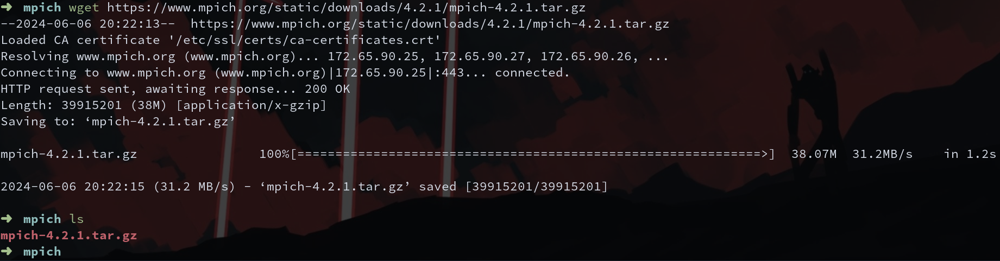
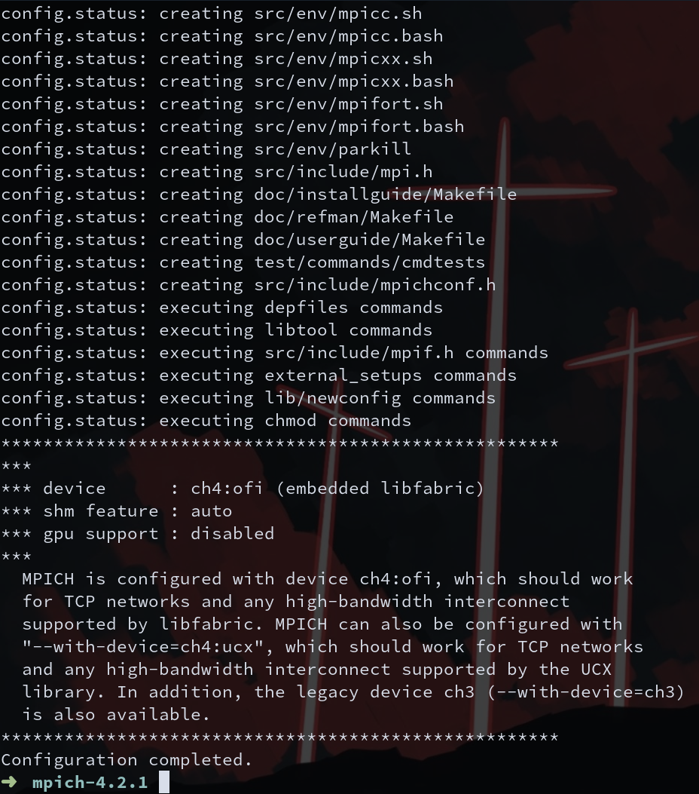
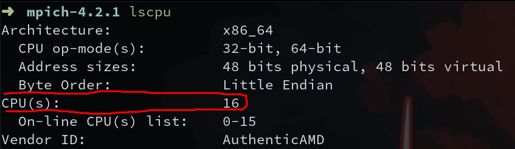
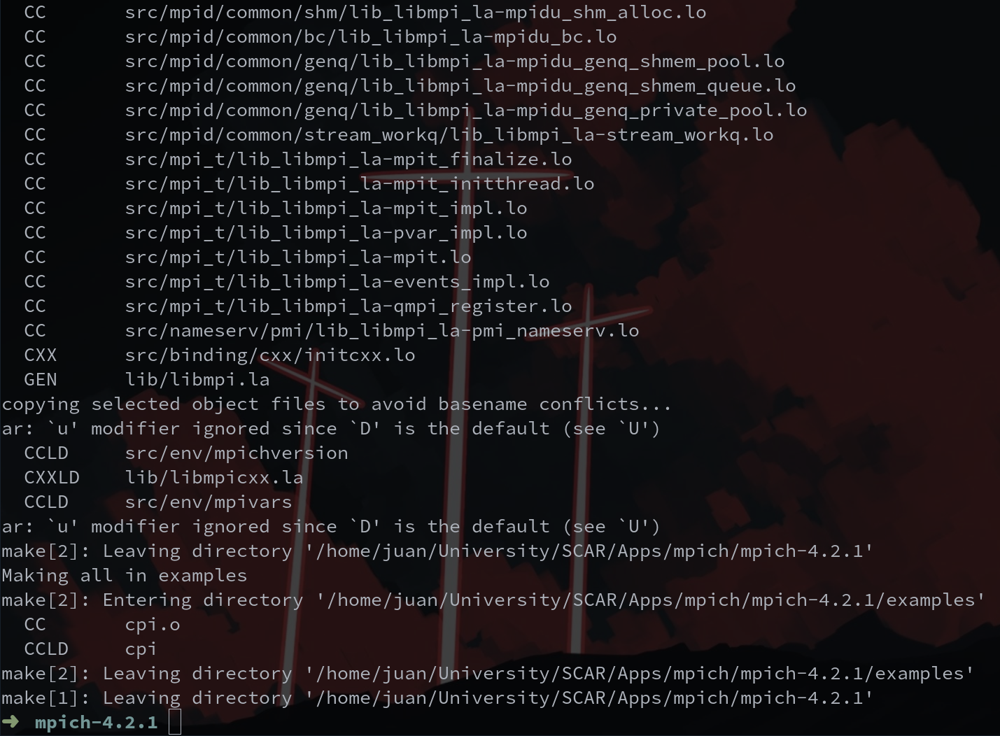
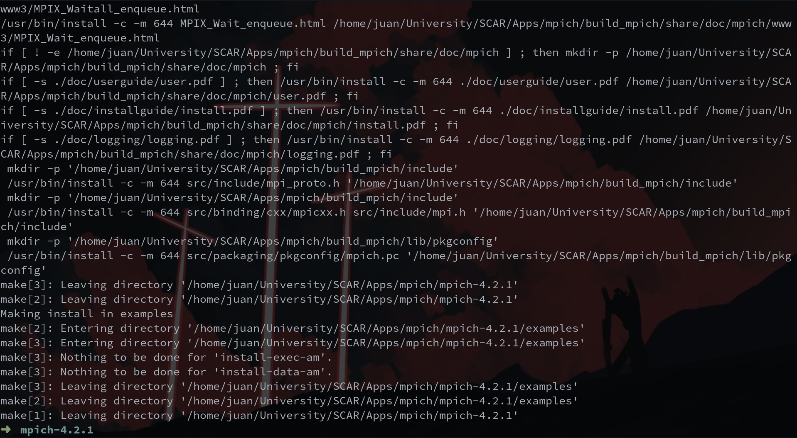

# MPICH Compilation

## Content
- [Introduction](#introduction)
- [What is MPICH?](#what-is-mpich)
    - [What is MPI?](#what-is-mpi)
- [Compilation](#compilation)
- [Table of Commands](#table-of-commands)
- [References](#references)
- [Authors](#authors)

## Introduction
In this file, you are going to learn how to compile MPICH-4.2.1 step by step. This is a good exercise for you because you are going to practice some themes that you may not remember from the lectures (i.e., Environment Variables, and Compilation), and you are going to start using the command line (and Linux), which is an essential tool in HPC.

We are going to start by explaining what MPICH is, then we are going to compile this application, and finally see a table with every command that we used and review their usage.

It is important to note that this is one of your first compilations, so there are some things that you may not understand. However, feel free to ask questions. Also, there are some steps that are not entirely necessary, but you need practice to notice this.

## What is MPICH?
MPICH is a high-performance and widely portable implementation of the Message Passing Interface (MPI) standard (MPI-1, MPI-2 and MPI-3). 

The goals of MPICH are: 

1. To provide an MPI implementation that efficiently supports different computation and communication platforms including commodity clusters (desktop systems, shared-memory systems, multicore architectures), high-speed networks (10 Gigabit Ethernet, InfiniBand, Myrinet, Quadrics) and proprietary high-end computing systems (Blue Gene, Cray).

2. To enable cutting-edge research in MPI through an easy-to-extend modular framework for other derived implementations.

### What is MPI?
MPI, which stands for Message Passing Interface, is a specification for a standardized and portable interface to a library capable of supporting communications and related operations that are useful for distributed memory programming. Distributed memory programming is characterized by the fact that processes cannot directly see each other's data. This means that a library is needed to effect such communication through explicit send and receive calls. 

MPI is not a library implementation by itself, but rather, there are many available implementations that will be discussed later in this tutorial. In the MPI model, communication among the processes in nodes on a distributed memory system is accomplished within a parallel program by passing messages between them, as facilitated by MPI's standardized function and subroutine calls. Interfaces to the MPI routines are defined for multiple languages, including C, C++, and Fortran.

## Compilation
First, locate a directory to download the `.tar.gz` file. In my case, I'm going to be in the following directory:
```
/home/juan/University/SCAR/Apps/mpich
```
**NOTE:** This directory only exist on my compute; you will have a different directory, so ***be carefull***. 

Execute the following command to get the `.tar.gz` file:
```
wget https://www.mpich.org/static/downloads/4.2.1/mpich-4.2.1.tar.gz
```

If you list (*ls* command) you will notice that there is a new file:


Let's decompress this file:
```
tar xf mpich-4.2.1.tar.gz
```

This will create a new directory called *mpich-4.2.1*.

In the same root directory where the mpich directory and `.tar.gz` are, we are going to create a new directory:
```
mkdir build_mpich
```
In this directory we are going to compile mpich.

At this step, I recommend you enter the *build_mpich* directory and execute *pwd*. This will show you the path where you are. In my case:
```
/home/juan/University/SCAR/Apps/mpich/build_mpich
```
Save this path for later.

Go back and enter the *mpich-4.2.1* directory:
```
cd ../mpich-4.2.1
```

Execute the configure file:
```
./configure --prefix=path_to_build_mpich_directory
```
Replace ***path_to_build_mpich_directory*** with your specific directory. In my case:
```
./configure --prefix=/home/juan/University/SCAR/Apps/mpich/build_mpich
```
**NOTE:** If you don't have fortran on your system, you can add `--diable-fortran` flag to avoid errors. Example:
```
./configure --prefix=/home/juan/University/SCAR/Apps/mpich/build_mpich --diable-fortran
```

At the end, you should see the following message:


You can check by executing `echo $?`, and if you get a 0, the configuration was succesful. If you get any error, check the Fortran flag, and if that doesn't work, talk to us.

Now, let's build MPICH:
```
make -j n/2
```
**Note:** *n* represents the number of cores that you have. In my case, I have 16, so n = 16, then n/2 = 8. If you don't know how many cores you have, you can execute `lscpu` and look for `CPU(s):`



This procces can take a while, so be patience.

When it's done, you will see the following message:

Again, you can check using the `echo $?` command.

Now, install:
```
make install
```
In a few seconds, you should see:

Again, you can check using the `echo $?` command.

Now, we have already compile MPICH! However, if we try to use a command from MPICH like `mpicc` or `mpirun`, we will get an error. But why? Well, because our system doesn't recognize those commands. We need to add them to our `$PATH` environment variable:
```
export PATH="$PATH:/home/juan/University/SCAR/Apps/mpich/build_mpich/bin"
```
**NOTES:**
- Replace the directory for YOUR directory.
- We are exporting the exeutables that are within the bin directory.

Now, you can execute and use commands from MPICH from anywhere in your system! Remember, if you open a new terminal session or restart yor pc, you will need to execute the `export` command again to use MPICH commands.

## Table of Commands

| **Command** | **Usage** | **Flags** |
|-------------|-----------|-----------|
| **wget** | Is a command-line tool that makes it possible to download files from the internet directly to your active directory. It supports downloads via FTP, SFTP, HTTP, and HTTPS. | In this case we have not used any flag, but if you want to check them you can run `wget -h`. |
| **tar** | It is short for Tape Archive and is used to create and extract archive files. | -x: the option extracts the archive file. <br/> -f: specifies the filename of the archive file. |
| **make** | Automates the process of creating and compiling applications from their source code. When compiling an application, the utility reads a makefile that contains instructions on how to build the application and then executes the necessary commands to carry out the build process. | -j: specifies the number of jobs (commands) to run simultaneously. With no argument, `make` runs as many jobs simultaneously as possible. |
| **make install** | Execute the install function / section inside Makefile | *N/A* |
| **export** | Provides the ability to update the current shell session about the change you made to the exported variable. | *N/A* |

Some commands are not included in the table, because they are easier to understand, such as `cd`, `mkdir`, and `ls`.

## Authors
- Juan Manuel Gómez
- Santiago Rodriguez
- Santiago Neusa

## References
- https://www.mpich.org/about/overview/
- https://cvw.cac.cornell.edu/mpi/intro/what-is-mpi
- https://www.geeksforgeeks.org/export-command-in-linux-with-examples/
- https://man7.org/linux/man-pages/man1/wget.1.html
- https://ftp.gnu.org/old-gnu/Manuals/make-3.79.1/html_node/make_93.html
- https://superuser.com/questions/360178/what-does-make-install-do